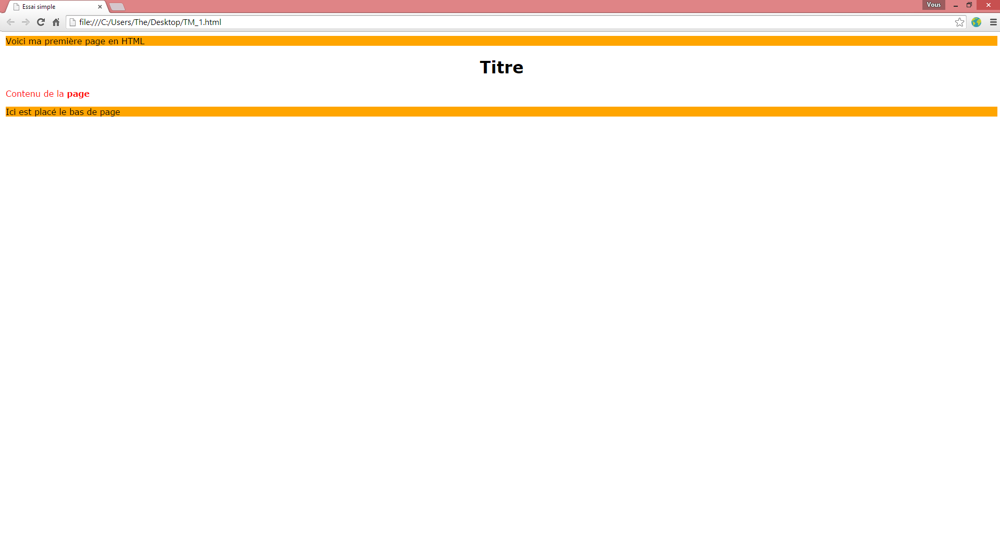
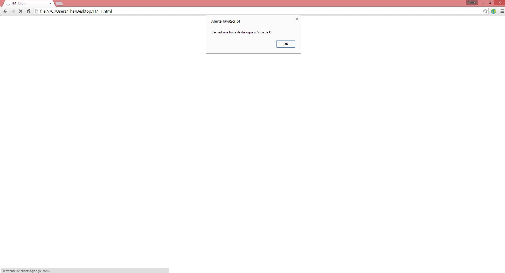
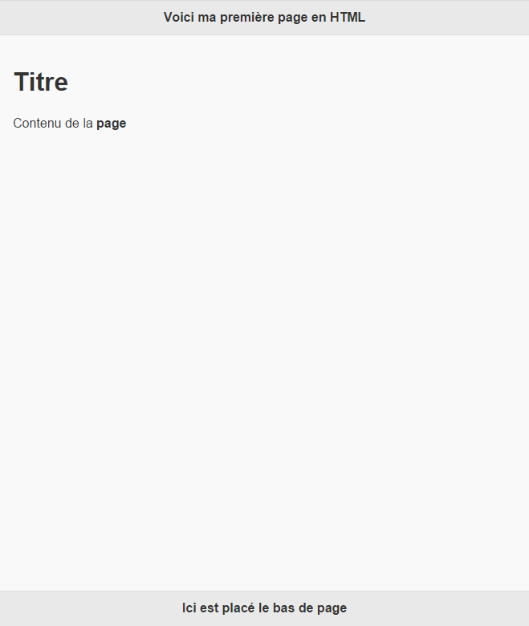

===========================================
Technologies utilisées pour le développement
===========================================

******
HTML 5
******
Abréviation de 'HyperText Markup Language 5', ce langage permet d'introduire le
contenu qui sera affiché dans une page. Celui-ci sera sectionné en différentes
catégories séparées par des balises. Exemple d'une page simple en html:

.. code-block:: html

    <!DOCTYPE html>
    <html>
        <!-- head est destiné à placer les scripts a charger CSS, Javascript,..., 
        spécifier l'encodage ou encore le titre qui sera sur l'onglet de la page -->
    	<head>
    		<meta charset="utf-8" />
    		<link rel="stylesheet" href="style.css"/>
    		
    		<title>Essai simple</title>
    	</head>
    	<!-- body contient tout le content chargé pour la page -->
    	<body>
    	    <!-- header correspond à l'entête -->
    		<header>Voici ma première page en HTML</header>
    		<!-- h1 correspond à un niveau de titre du plus au moins important:
    		h1, h2, h3, ..., h6 -->
    		<h1>Titre</h1>
    		<!-- p correspond a un paragraphe standard et stron à mettre le contenu
    		des balises en gras-->
    		
Contenu de la <strong>page</strong>

    		<!-- footer correspond au pied de page -->
    		<footer>Ici est placé le bas de page</footer>
    	</body>
    </html>
    
.. image:: _static/screenshots/desktop/HTML_presentation.png

*****
CSS 3
*****
Abréviation de 'Cascading Style Sheets 3', ce langage permet de structurer, 
personnaliser, modifier le code html. Et cela aussi bien en y ajoutant des
couleur, des grilles, des bordures,... Exemple sur la page HTML (dans le fichier
style.css, chargé dans la page html d'avant):

.. code-block:: css
    
    /* on applique la police Verdana a tous le corps de texte*/ 
    body
    {
        font-family: Verdana;
    }
    
    /* On aligne le titre h1 au centre */ 
    h1
    {
        text-align: center;
    }
    
    /* pour l'entête et le pied de page, on met leur arrière plan en orange */ 
    header, footer
    {
        background-color: orange
    }
    
    /* on met le texte en rouge dans les paragraphes */ 
    p
    {
        color: red
    }
    

    
**********
Javascript
**********
Le Javascript est un langage qui lui permet d'ajouter de l'interactivité dans ses
pages internet car comme vous avez pu le remarquer on se retrouve avec des pages
dite 'statiques' qui ne font qu'afficher du contenu. Nous allons ici ajouter une 
boite de dialogue avec javascript (dans le fichier
javascript.js, chargé dans la page html d'avant):

.. code-block:: javascript
    
    /* la fonction alert permet une boite de dialogue */ 
    alert("Ceci est une boite de dialogue à l'aide de JS.")
    

******
jQuery
******
JQuery est une bibliothèque javascript ce qui veut dire qu'elle est basée sur du 
code javascript avec des fonctions déjà préparée et pour pouvoir les utiliser,
nous devons charger un script supplémentaire comme l'on a fait avec le CSS et le
JS:

.. code-block:: html
    
    
    
En plus de cela jQuery utilise également des évènements qui, par exemple, lance 
des fonctions lorsqu'on clique sur une bouton. Sur notre page vous avez pu 
remarquer que la boite de dialogue s'ouvre avant le chargement de la page. Nous 
allons donc remplacer le code javascript d'avant par un autre qui 
affichera cette boite de dialogue seulement après le chargement:

.. code-block:: javascript
    
    /* on se réfère au document ouvert, donc la page qui quand elle est prête
    méthode 'ready' éxécute la fonction alert que l'on a vu précédemment*/ 
    $(document).ready(function(){
        alert("Voici la nouvelle boite de dialogue.");
    });

Et nous devrions obtenir un résultat de ceci:

.. image:: _static/screenshots/desktop/HTML_presentation_4.png

******
Django
******
Django est également une bibliothèque mais basée sur le langage python cette fois.
C'est une bibliothèque web qui permet de créer des sites internet de façon plutôt
intuitive une fois que l'on a appréhendé le fonctionnement de celle-ci. Tout
comme python, le langage django est relativement facile à comprendre et permet 
de proposer un site web efficace avec un effort qui est moindre.

******
python
******
Python est donc ce langage qui alimente django et qui lui permet la plupart des
actions. Celui-ci est plutôt de haut niveau ce qui signifie qu'il se rapproche
plutôt de la façon de penser de l'homme plutôt que de la machine. Un petit 
exemple qui illustre la syntaxe et l'allure du langage:

.. code-block:: python
    
    def somme(nbrUn, nbrDeux):
        """somme(float nbrUn, float nbrDeux) ---> float fonction qui retourne
        la somme de nbrUn et nbrDeux"""
        somme = nbrUn + nbrDeux
        return somme

*************
jQuery Mobile
*************

jquery mobile est cette fameuse bibliothèque que j'aurai l'occasion de présenter
d'une façon plus approfondie dans ce travail. Tout d'abord, il faut la charger
tous les scripts de la même façon que jQuery:

.. code-block:: html
    
    <!-- le script CSS qui va charger les éléments de style jQuery Mobile-->
    
    <link rel="stylesheet" href="http://code.jquery.com/mobile/1.4.5/jquery.
    mobile-1.4.5.min.css" />
    
    <!-- le script de jQuery qui est aussi nécessaire -->
    
    
    <!-- et enfin celui de jQuery Mobile -->
    
    
A partir de là, il ne nous reste plus qu'à retravailler le code html pour 
l'adapter au balisage jQuery Mobile. Aussi bien au niveau du nom de la balise,
attribuer un id spécifique ou le plus souvent une classe. Voici une page 
jQuery Mobile de base avec un rendu type 'écran mobile':

.. code-block:: html
    
    

    <!DOCTYPE html>
        <html>
            <head>
                <meta charset="utf-8" />
                <link rel="stylesheet" href="http://code.jquery.com/mobile/
                1.4.5/jquery.mobile-1.4.5.min.css" />
                
                
        		<title>Essai simple</title>
        	</head>
        	
        	<body>
        	    <!-- début de page --> 
                

                
                <!-- début entête --> 
                

                    <h1>Voici ma première page en HTML</h1>
                

                <!-- fin entête -->
                
                <!-- début contenu --> 
                

                    <h1>Titre</h1>
    		        
Contenu de la <strong>page</strong>

                

                <!-- fin contenu -->
                
                <!-- début bas de page --> 
                

                    <h4>Ici est placé le bas de page</h4>
                

                <!-- fin bas de page -->
                
                

                <!-- fin de page --> 
        	</body>
        </html>
        

On voit déjà ici la puissance de jQuery Mobile pour la mise en page qui malgré
son thème de base reste très agréable et s'adapte bien au petits écrans.